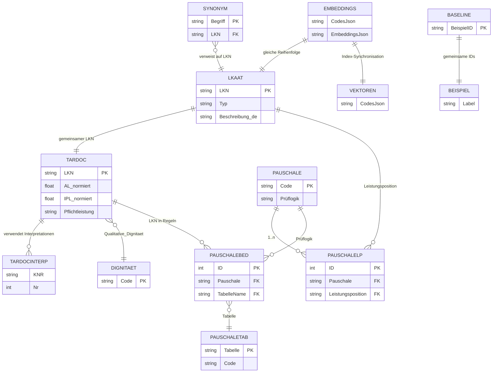

# JSON-Daten im Verzeichnis `data`

Dieses Dokument beschreibt alle JSON-Dateien unter `data/`, ihren Inhalt, die jeweiligen Datenquellen, wie die Artefakte erzeugt werden, das Einsatzgebiet im Projekt sowie die Beziehungen der Datensätze zueinander. Es richtet sich an Personen, die das System pflegen oder erweitern möchten.

## Entstehung & Datenquellen

### Konfigurationsbasis
- `config.ini` definiert Pfade zu allen Eingangsdaten (Access-Datenbanken, CSV, Excel, JSON) sowie das Ausgabeverzeichnis `JSON_Data/`. Die Felder `VALID_FROM` und `VALID_TO` legen fest, welche Datensätze aus den Quellsystemen exportiert werden.
- Alle Access-Verbindungen nutzen den Treiber `Microsoft Access Driver (*.mdb, *.accdb)`. Für neue Releases werden die Pfade auf die jeweils aktuelle Version (z. B. `TARDOC_20250808.accdb`, `250808_LKAAT_v1.0c_...accdb`) angepasst.
- Parallel zum aktuellen Ausgabeverzeichnis liegt `JSON_Data Version 1.1b 20250410/` als eingefrorener Vergleichsstand.

### Verarbeitungsschritte für die Access-Daten
1. **`1_Import_tblPauschalen_und_tblCapitulum.py`:**  
   - Importiert die offiziellen Stammdaten: CSV `Anhang A1 Katalog` für Pauschalen/Capitula, die Access-Datei `DB_LKAAT_ACCDB` für den Leistungskatalog, sowie den Entscheidungsbaum `system_ambP_*.json`.  
   - Befüllt `Pauschalen.accdb` (Tabellen `tblPauschalen`, `tblCapitulum`, `tblLeistungskatalog`, `tblTabellen`, `tblLeistungskatalog_Hierarchie`) und extrahiert zusätzlich für jede Pauschale die frei formulierte Prüflogik.
2. **`2_tblBedingungen_Fuellen.py`:**  
   - Parst die Prüflogik in einen AST, legt strukturierte Bedingungen in `tblPauschaleBedingungen` an und nummeriert logische Gruppen neu.  
   - Optionaler `--selftest` rekonstruiert die Logik zur Plausibilisierung.
3. **`3_FindeFehlendetblTabellenWerte.py`:**  
   - Aktualisiert `tblTabellen` um Bezeichnungen aus der OAAT/OTMA-API (`/Definitionshandbuch/tabelle/`) sowie ICD-10-Excel-Dateien in drei Sprachen.  
   - Füllt `Code_Text` für Servicekatalog-Codes via SQL-Join gegen `tblLeistungskatalog`.
4. **`4_tblPauschaleBedingungen_optimieren.py`:**  
   - Entfernt redundante Zeilen aus `tblPauschaleBedingungen` und schreibt das Ergebnis nach `tblPauschaleBedingungen_optimiert`, ohne die boolesche Logik zu ändern.
5. **`7_Erstelle_JSON_Dateien.py`:**  
   - Exportiert auf Basis von `attribute_map.json` und den `config.ini`-Filtern die Access-Daten in die Serien `LKAAT_*.json`, `TARDOC_*.json`, `PAUSCHALEN_*.json` sowie `DIGNITAETEN.json`.  
   - Das Skript bietet optional ein Tkinter-Progressfenster und bereinigt Steuerzeichen/Zero-Width-Characters vor dem Schreiben.
6. **`8_Erstelle_CHOP_JSON.py`:**  
   - Liest den offiziellen CHOP-Excel-Katalog (`CHOP_2025.xlsx`), erzeugt Hierarchiemetadaten, Freitextpayloads und exportiert `CHOP_Katalog.json`.

### Weitere Artefaktpipelines
- **Synonymkatalog:**  
  `Entwicklung/acht_Erstelle_JSON_SynonymKatalog.py` kombiniert `JSON_Data/LKAAT_Leistungskatalog.json`, manuell gepflegte Listen (`manuelle_synonyme.json`) sowie NLTK-basierte Termextraktion, um `LKAAT_Synonymkatalog_final.json` zu erzeugen. Die Datei wird mit `gui_synonym_tool.py` bzw. `python -m synonyms` nachbearbeitet und als `data/synonyms.json` in den Hauptzweig des Projekts übernommen.
- **Embeddings & FAISS-Index:**  
  Ein separates RAG-Build-Skript (`generate_embeddings.py` im Hauptprojekt) lädt `data/LKAAT_Leistungskatalog.json` und `data/synonyms.json`, erstellt Sentence-Transformer-Embeddings (`leistungskatalog_embeddings.json`), schreibt die Code-Reihenfolge (`vektor_index_codes.json`) und baut daraus `vektor_index.faiss`. Die drei Dateien müssen immer gemeinsam aktualisiert werden.
- **Qualitätsreferenzen:**  
  `baseline_results.json` sowie `beispiele.json` werden im Rahmen der manuellen und automatisierten Tests gepflegt. `run_quality_tests.py`, die Weboberfläche `quality.html` und API-Endpunkte `/api/test-example` sowie `/api/quality` konsumieren diese Artefakte.
- **Verteilte Builds:**  
  Das Verzeichnis `dist/` enthält unabhängige Exporte (z. B. `dist/CHOP-Katalog.json`) für externe Nutzung; sie werden aus denselben Quellskripten gespeist.

## Schneller Überblick

| Datei | Struktur | Einträge | Primärer Bezug | Hauptzweck |
| --- | --- | --- | --- | --- |
| `LKAAT_Leistungskatalog.json` | Liste von Objekten | 3 253 | `LKN` | Stammdaten aller Einzelleistungen inkl. mehrsprachiger Beschreibungen |
| `TARDOC_Tarifpositionen.json` | Liste von Objekten | 1 388 | `LKN` | Vollständige TARDOC-Tarifpositionen mit Regeln, Zeiten, Dignitäten sowie Min/Max-Alter und Geschlechtsvorgaben für Demografie-Matching |
| `TARDOC_Interpretationen.json` | Wörterbuch -> Listen | 3 Listen | `KNR` / `Nr` | Allgemeine & kapitelspezifische Interpretationen |
| `DIGNITAETEN.json` | Liste von Objekten | 157 | `DignitaetCode` | Qualitative Dignitäten (DE/FR/IT) |
| `PAUSCHALEN_Pauschalen.json` | Liste von Objekten | 314 | `Pauschale` | Metadaten zu Pauschalen inkl. Prüflogik und Taxpunkten |
| `PAUSCHALEN_Leistungspositionen.json` | Liste von Objekten | 11 323 | `ID` | Zuordnung von Einzelleistungen zu Pauschalen |
| `PAUSCHALEN_Bedingungen.json` | Liste von Objekten | 2 538 | `BedingungsID` | Bedingungslogik pro Pauschale |
| `PAUSCHALEN_Tabellen.json` | Liste von Objekten | 19 603 | `Tabelle` + `Code` | Nachschlagetabellen für ICD-, Medikament- und Leistungslisten |
| `PAUSCHALEN_Tabellen_precise_map.json` | Dict: Tabelle → Liste Pauschalen | variabel | `Tabelle` | Vorberechneter Index nicht-breiter Tabellen auf Pauschalen |
| `PAUSCHALEN_Tabellen_broad_map.json` | Dict: Tabelle → Liste Pauschalen | variabel | `Tabelle` | Vorberechneter Index breiter Tabellen (z. B. OR/ELT/NONELT) |
| `Pauschale_cond_table_precise.json` | Dict: Pauschale → Tabellen | variabel | `Pauschale` | Split der Tabellen-Bedingungen (präzise) pro Pauschale |
| `Pauschale_cond_table_broad.json` | Dict: Pauschale → Tabellen | variabel | `Pauschale` | Split der Tabellen-Bedingungen (breit) pro Pauschale |
| `lkn_to_tables_precise.json` | Dict: LKN → Tabellen | variabel | `LKN` | LKN‑→Tabellen-Mapping (nicht-breit) |
| `lkn_to_tables_broad.json` | Dict: LKN → Tabellen | variabel | `LKN` | LKN‑→Tabellen-Mapping (breit, z. B. OR/NONELT) |
| `pauschalen_indices_meta.json` | Objekt | 1 | - | Meta (Broad-Liste, Counts, Generator-Version) für vorberechnete Pauschalen-Indizes |
| `synonyms.json` | Wörterbuch -> Objekte | 3 201 | Freitext | Synonyme & Komponenten für LKN-Codes |
| `leistungskatalog_embeddings.json` | Wörterbuch mit Listen | 2 Schlüssel | - | Vorberechnete Vektor-Embeddings für LKN-Kontext |
| `vektor_index_codes.json` | Liste | 3 253 | Reihenindex | Reihenfolge der LKN-Codes im FAISS-Index |
| `baseline_results.json` | Wörterbuch -> Objekte | 21 | Beispiel-ID | Referenzresultate für Qualitätstests |
| `beispiele.json` | Liste von Objekten | 17 | - | Ausformulierte Prompts (DE/FR/IT) für Tests & Demo |
| `CHOP_Katalog.json` | Liste von Objekten | 13 599 | `code` | CHOP-Prozedurenkatalog (DE) für Suchfunktion |

## Beziehungsübersicht (ERD)

*Hinweis: Die Felder `CodesJson` und `EmbeddingsJson` stehen stellvertretend für die Listenstrukturen; im JSON liegen die Werte jeweils als Arrays vor.*

## Detailbeschreibungen

### LKAAT_Leistungskatalog.json

- **Quelle & Erstellung:** `7_Erstelle_JSON_Dateien.py` (Funktion `create_lkaat_leistungskatalog_json`) lädt die offizielle Access-Datei `DB_LKAAT_ACCDB` (`250808_LKAAT_v1.0c_...accdb`). Es verknüpft `LEISTUNG` mit `LEISTUNG_TEXT` für DE/FR/IT, wandelt Flagfelder (`USED_FOR_GROUPING`, `ASSIGNED_SERVICE_POSITION`) in Booleans um und filtert auf gültige Datensätze gemäß `VALID_FROM/VALID_TO`. Das gleiche Schema wird durch Skript 1 vorab in die lokale Access-Datenbank repliziert.
- **Format & Umfang:** Liste mit 3 253 Einträgen. Jeder Eintrag besitzt den Schlüssel `LKN`.
- **Zentrale Felder:** `Typ` (z. B. `E`, `EZ`), `Lateralität`, `Prozedurentyp`, `Grouperrelevanz`, `ZugeordneteLeistung`, `Beschreibung` und `MedizinischeInterpretation` (jeweils in DE/FR/IT).
- **Verwendung:** Wird beim Serverstart in `server.py` (`load_data`) geladen und dient als primäre Quelle für Kontextaufbau, Regelprüfungen und Ausgabe. `regelpruefer_pauschale.py` und `regelpruefer_einzelleistungen.py` nutzen die Daten für Beschreibungen. Das Frontend (`calculator.js`) und die Synonym-GUI (`synonyms/__main__.py`) greifen für Anzeigen und Validierungen darauf zu.
- **Beziehungen:** Basis für Synonyme, Embeddings, Pauschalprüfungen und Dignitätszuordnungen. LKN-Codes tauchen in fast allen anderen JSON-Dateien wieder auf.
- **Pflege:** Bei neuen Katalogversionen müssen Synonymliste, Embeddings und ggf. Pauschal-Tabellen aktualisiert werden.

### TARDOC_Tarifpositionen.json

- **Quelle & Erstellung:** Generiert durch `create_tardoc_tarifpositionen_json` (`7_Erstelle_JSON_Dateien.py`) aus `DB_TARDOC_ACCDB`. Für jede LNR werden Stammdaten (`LEISTUNG`), Texte (`LEISTUNG_TEXT`), Altersgrenzen (`LEISTUNG_ALTER`), Hierarchien (`LEISTUNG_HIERARCHIE`), Leistungsgruppen (`LEISTUNG_GRUPPEN` + `CT_LEISTUNG_GRUPPEN`), Blockzugehörigkeiten (`LEISTUNG_BLOECKE`), Mengen- und Kumulationsregeln (`LEISTUNG_MENGEN_ZEIT`, `LEISTUNG_KUMULATION`) sowie Kapiteltexte (`KAPITEL_TEXT`) zusammengezogen. Sprach- und Einheiten-Tabellen werden dynamisch nachgeladen; Gültigkeitsfilter stammen aus `config.ini`.
- **Format & Umfang:** Liste mit 1 388 Tarifeinträgen.
- **Zentrale Felder:** Administrative Angaben (`KapitelNummer`, `Kapitel`, `Seite`), betriebswirtschaftliche Werte (`AL_(normiert)`, `IPL_(normiert)`, `Zeit_*`, `FaktorAL_R`), Abrechnungsattribute (`Pflichtleistung`, `Behandlungsart`, `Sparte`, `DigniQuantitativCode`, `Qualitative_Dignitaet`), optionale Grenzen (`Min/MaxAlter`, `Geschlecht`, `MaxToleranzTage`) sowie `Regeln` (z. B. Mengenbeschränkungen, nicht kumulierbare Leistungen, Zusatzpositionen).
- **Verwendung:** Server lädt die Datei (siehe `server.py:1826ff`) und extrahiert daraus Regeln, Dignitätsanforderungen und demografische Informationen. Die Weboberfläche bindet sie zur Anzeige der Tarife ein (`calculator.js`).
- **Beziehungen:** Teilt `LKN` mit `LKAAT_Leistungskatalog.json`, verweist über `Qualitative_Dignitaet` auf Einträge aus `DIGNITAETEN.json` und referenziert generische Regeln aus `TARDOC_Interpretationen.json`.
- **Pflege:** Bei Updates müssen Folgeartefakte (Synonyme, Embeddings) geprüft werden; die Regelinterpretation erfolgt direkt aus dieser Datei.

### TARDOC_Interpretationen.json

- **Quelle & Erstellung:** `create_tardoc_interpretationen_json` liest `KAPITEL_INTERPRETATION_TEXT` aus `DB_TARDOC_ACCDB`, gruppiert nach `KNR` und `KAP_INTERPRET_NR`, fügt sprachspezifische Felder hinzu und teilt in die Blöcke `AllgemeineDefinitionen`, `GenerelleInterpretationen` und `Kapitelinterpretationen` auf.
- **Format & Umfang:** Wörterbuch mit drei Listen: `AllgemeineDefinitionen` (10), `GenerelleInterpretationen` (28) und `Kapitelinterpretationen` (105).
- **Struktur:** Jeder Eintrag besitzt `KNR`, `Nr`, `Bezeichnung` plus mehrsprachige `Interpretation`.
- **Verwendung:** `calculator.js` führt die Listen zusammen, um Interpretationshilfen anzuzeigen (z. B. Tooltips zu Regeln). Der Server lädt die Daten für spätere Erweiterungen mit.
- **Beziehungen:** Ergänzt die Regeltexte aus `TARDOC_Tarifpositionen.json`; keine direkten Schlüsselabhängigkeiten.

### DIGNITAETEN.json

- **Quelle & Erstellung:** Exportiert durch `create_dignitaeten_json` aus der TARDOC-Control-Tabelle `CT_DIGNI_QUALI`. Pro `QL_DIGNITAET` werden die Texte für DE/FR/IT nach `VALID_FROM/VALID_TO` selektiert.
- **Format & Umfang:** Liste mit 157 Dignitäten.
- **Felder:** `DignitaetCode` sowie `DignitaetText` in DE/FR/IT.
- **Verwendung:** Frontend mappt Codes aus `TARDOC_Tarifpositionen.json` auf Klartexte (`calculator.js`). Server kann bei Prüfungen Mindestdignitäten anzeigen.
- **Beziehungen:** Codes werden in den Feldern `Qualitative_Dignitaet` der TARDOC-Tarifpositionen und `Dignitaeten` der Pauschalen verwendet.

### PAUSCHALEN_Pauschalen.json

- **Quelle & Erstellung:** Stammt aus `tblPauschalen` in `Pauschalen.accdb`. Die Tabelle wird mit `1_Import_tblPauschalen_und_tblCapitulum.py` aus dem offiziellen CSV `Anhang A1 Katalog der Ambulanten Pauschalen` befüllt; Prüflogiken werden aus dem Entscheidungsbaum `system_ambP_*.json` extrahiert und sprachlich normalisiert. Nachfolgende Durchläufe von Skript 2 und 4 ändern den Stammdatensatz nicht.
- **Format & Umfang:** 314 Pauschalen.
- **Felder:** `Pauschale` (Code), `Pauschale_Text` (DE/FR/IT), `Prüflogik` (vertextlichte Bedingung), `Taxpunkte`, `Dignitaeten` (Pipe-getrennte qualitative Codes) sowie `Implantate_inbegriffen`.
- **Verwendung:** Der Server lädt die Daten in `pauschalen_dict` und liefert sie für Vorschlag, Prüfung und Ergebnisdarstellung. Die Texte dienen sowohl Backend als auch Frontend.
- **Beziehungen:** Verweist auf Bedingungen (`PAUSCHALEN_Bedingungen.json`), Tabellen (`PAUSCHALEN_Tabellen.json`), Leistungspositionen (`PAUSCHALEN_Leistungspositionen.json`) und Dignitäten.

### PAUSCHALEN_Leistungspositionen.json

- **Quelle & Erstellung:** Direktexport aus `tblPauschaleLeistungsposition` in `Pauschalen.accdb`. Die Zuordnungen werden fachlich in Access gepflegt und mit der begleitenden Excel-Datei `Excel_Data/tblPauschaleLeistungsposition.xlsx` abgestimmt; `7_Erstelle_JSON_Dateien.py` übernimmt die Daten unverändert.
- **Format & Umfang:** 11 323 Zuordnungen.
- **Felder:** `ID`, `Pauschale`, `Leistungsposition`, `Tabelle`.
- **Verwendung:** Liefert dem Regelwerk, welche TARDOC-Codes (oder Listen) zu einer Pauschale gehören. Der Server nutzt diese Liste in `determine_applicable_pauschale` und für UI-Anreicherungen.
- **Beziehungen:** `Pauschale` verweist auf `PAUSCHALEN_Pauschalen.json`; `Leistungsposition` referenziert LKN-Codes aus `LKAAT_Leistungskatalog.json`. `Tabelle` verlinkt optional auf `PAUSCHALEN_Tabellen.json`.

### PAUSCHALEN_Bedingungen.json

- **Quelle & Erstellung:** Ergebnis von `2_tblBedingungen_Fuellen.py`, das die textuelle Prüflogik aus `tblPauschalen` in strukturierte Zeilen übertraegt. Optional kann `4_tblPauschaleBedingungen_optimieren.py` redundante Einträge entfernen; exportiert wird standardmäßig die optimierte Sicht.
- **Format & Umfang:** 2 538 Bedingungsknoten.
- **Wichtige Felder:** `Pauschale`, `Gruppe`/`GruppenOperator` (logische Klammerung), `Bedingungstyp` (z. B. `LEISTUNGSPOSITIONEN IN TABELLE`, `MEDIKAMENTE IN LISTE`, `ANZAHL`, `SEITIGKEIT`), `Operator`, `Werte`, `Ebene`, `ConnectorTarget` (Verknüpfung im Baum), optionale JSON-Felder für komplexe Varianten.
- **Verwendung:** Wird vom Regelprüfer eingelesen (`regelpruefer_pauschale.py`) und in strukturierte Logik überführt. Der Server erzeugt daraus HTML-Beschreibungen, validiert Patientendaten (Alter, Geschlecht) und checkt Leistungslisten.
- **Beziehungen:** Verweist auf Pauschalen (`Pauschale`). Tabellennamen in `Werte` oder `Spezialbedingung` verknüpfen zu `PAUSCHALEN_Tabellen.json`. Leistungspositionen und Medikamente referenzieren LKN- bzw. pharmazeutische Codes, die ebenfalls in den Tabellen gepflegt sind.

### PAUSCHALEN_Tabellen.json

- **Quelle & Erstellung:** Exporte aus `tblTabellen` in `Pauschalen.accdb`. Rohdaten stammen aus dem Entscheidungsbaum (`system_ambP_*.json`, importiert durch Skript 1); `3_FindeFehlendetblTabellenWerte.py` ergänzt Bezeichnungen per API, ICD-Excel und SQL-Join gegen `tblLeistungskatalog`. Die Excel-Datei `Excel_Data/tblTabellen.xlsx` dient als Review-Werkzeug.
- **Format & Umfang:** 19 603 Zeilen.
- **Felder:** `Tabelle` (Name), `Tabelle_Typ` (`service_catalog`, `icd`, `402`), `Code`, `Code_Text` (DE/FR/IT).
- **Verwendung:** Nachschlagebasis für Bedingungen (`Leistungspositionen in Tabelle`, `Hauptdiagnose in Tabelle`, Medikamentenlisten). Der Server gruppiert die Daten nach `Tabelle` für schnelle Zugriffe und baut ein Medikamenten-Lookup.
- **Beziehungen:** Tabellennamen werden von Pauschalbedingungen und Pauschal-Leistungspositionen referenziert. ICD-Codes werden für Diagnosen verwendet.

### Vorberechnete Pauschalen-Indizes (optional)

- **Dateien:** `PAUSCHALEN_Tabellen_precise_map.json`, `PAUSCHALEN_Tabellen_broad_map.json`, `Pauschale_cond_table_precise.json`, `Pauschale_cond_table_broad.json`, `lkn_to_tables_precise.json`, `lkn_to_tables_broad.json`, `pauschalen_indices_meta.json`.
- **Inhalt:** Splits der Tabellen-Bedingungen in präzise vs. breite Tabellen (z. B. OR/ELT/NONELT/ANAST), vorgerechnete Reverse-Indizes Tabelle→Pauschale sowie LKN→Tabellen, plus Meta (Broad-Liste, Zählungen).
- **Verwendung:** `server.py` lädt diese Dateien beim Start, um die Kandidatensuche für Pauschalen ohne Laufzeit-Splitting zu betreiben und Broad-Tabellen erst als Fallback zu prüfen. Fehlen die Dateien, werden die Splits zur Laufzeit aus den Basistabellen erzeugt.

### synonyms.json

- **Quelle & Erstellung:** Wird aus `LKAAT_Synonymkatalog_final.json` abgeleitet. Der Katalog entsteht durch `acht_Erstelle_JSON_SynonymKatalog.py`, das LKAAT-Texte analysiert, Tokens mit NLTK filtert und manuell kuratierte Synonyme (`manuelle_synonyme.json`) anreichert. Mit `gui_synonym_tool.py` bzw. `python -m synonyms` erfolgt die redaktionelle Pflege vor dem Export als `data/synonyms.json`.
- **Format & Umfang:** Wörterbuch mit 3 201 Einträgen. Schlüssel ist ein Freitextbegriff.
- **Felder pro Eintrag:** `lkn` (Hauptcode), `lkns` (Liste weiterer LKNs), optionale `synonyms` (mehrsprachige Varianten) und `components` (segmentierte Begriffe mit Alternativen). Ergänzend existiert ein Index nach Normalformen (`SynonymCatalog.index`).
- **Verwendung:** Bei aktiviertem Synonym-Modul (`config.ini`, Abschnitt `[SYNONYMS]`) lädt der Server den Katalog (`server.py`), erweitert Suchbegriffe und normalisiert LLM-Vorschläge. Die Synonym-GUI (`python -m synonyms`) bearbeitet diese Datei interaktiv; `synonyms/generator.py` kann Vorschläge erzeugen.
- **Beziehungen:** Alle verknüpften Codes müssen in `LKAAT_Leistungskatalog.json` existieren. Änderungen erfordern ein Nachziehen der Embeddings.

### leistungskatalog_embeddings.json

- **Quelle & Erstellung:** Entsteht zusammen mit `vektor_index.faiss` durch das Embedding-Build-Skript (`generate_embeddings.py`). Grundlage sind `data/LKAAT_Leistungskatalog.json` und `data/synonyms.json`; pro LKN wird ein 384-dimensionaler Vektor (Sentence-Transformer) berechnet.
- **Format & Umfang:** Wörterbuch mit zwei Listen: `codes` (3 253 LKNs) und `embeddings` (3 253 x 384 floats).
- **Verwendung:** Dient dem Retrieval-Augmented-Generation-Modus. Der Server lädt gemeinsam mit `vektor_index.faiss` und `vektor_index_codes.json` die Embeddings, um relevante Katalogeinträge vorzufiltern.
- **Beziehungen:** Reihenfolge identisch zu `vektor_index_codes.json` und `LKAAT_Leistungskatalog.json`. Erzeugt durch `generate_embeddings.py`, das den Leistungskatalog und Synonyme benötigt.
- **Pflege:** Nach Katalog-/Synonymänderungen `python generate_embeddings.py` ausführen.

### vektor_index_codes.json

- **Quelle & Erstellung:** Begleitartefakt des Embedding-Builds; das Skript speichert die LKN-Reihenfolge, die auch im FAISS-Index (`vektor_index.faiss`) verwendet wird.
- **Format & Umfang:** Liste der 3 253 LKN-Codes in der Reihenfolge des FAISS-Vektorraums.
- **Verwendung:** Beim Laden des FAISS-Index (`server.py`) zur Zuordnung von Trefferpositionen zurück zu LKN-Codes.
- **Beziehungen:** Muss exakt zur Embedding-Datei und zum gespeicherten FAISS-Index passen.

### baseline_results.json

- **Quelle & Erstellung:** Manuell gepflegte Referenzfälle, gepflegt zusammen mit `beispiele.json`. Neue Modellstände werden mit `run_quality_tests.py` gegen die Baseline geprüft; nach akzeptierter Änderung werden die `baseline`-Werte aktualisiert.
- **Format & Umfang:** Wörterbuch mit 21 Testfällen (`"1"`, `"2"` ...).
- **Felder:** `query` (DE/FR/IT Prompttexte), `baseline` (Referenzergebnis mit `pauschale` und/oder `einzelleistungen`), `current` (Platz für aktuelle Testergebnisse).
- **Verwendung:** Backend-Endpunkte `/api/test-example` und `/api/quality` lesen die Referenzwerte (`server.py`). Das Frontend `quality.html` vergleicht Live-Ergebnisse mit den Baselines; Skripte `run_quality_tests.py` und `llm_vergleich.py` nutzen dieselbe Quelle.
- **Beziehungen:** IDs korrespondieren zu Einträgen in `beispiele.json`.
- **Pflege:** Nach Modell- oder Regeländerungen Testlauf starten und Ergebnisse prüfen/aktualisieren.

### beispiele.json

- **Quelle & Erstellung:** Wird gemeinsam mit `baseline_results.json` gepflegt. Ausgangsbasis sind echte Support-Fälle und interne Tests, die in DE/FR/IT ausformuliert werden.
- **Format & Umfang:** Liste mit 17 Beispielen.
- **Felder:** `label` (Kurzname), `value_*` und `extendedValue_*` für DE/FR/IT (Kurz- bzw. Langtext).
- **Verwendung:** Dient UI-Dropdowns und Qualitätstests (`quality.js`). Die Texte speisen Prompts und verweisen indirekt auf die Baseline-Erwartungen.
- **Beziehungen:** Index in der Liste entspricht den IDs in `baseline_results.json`.

### CHOP_Katalog.json

- **Quelle & Erstellung:** `8_Erstelle_CHOP_JSON.py` verarbeitet `CHOP_2025.xlsx` (Pfad in `[script8_paths]`). Das Skript löst Hierarchien (Kapitel, Gruppe, Hauptcode) auf, sammelt Synonyme/Notizen, erzeugt einen Freitext-Payload und schreibt nach `JSON_Data/CHOP_Katalog.json`. Eine SHA-256-Checksumme wird am Ende geloggt.
- **Format & Umfang:** 13 599 Prozeduren.
- **Felder:** `code`, `description_de`, `freitext_payload` (Kurzbeschreibung + Freitext), `chapter_code`, `group_code`, `main_code`, `main_description_de`, `lateralite`.
- **Verwendung:** Wird im Server geladen (`chop_data`) und über `/api/chop` durchsucht. Unterstützt Nutzer beim Nachschlagen von CHOP-Codes.
- **Beziehungen:** Steht unabhängig von TARDOC-Daten; kann bei Bedarf mit Pauschalen oder Zusatzlogik verknüpft werden.

## Pflege-Workflows und Abhängigkeiten

- **Neue Tarifversion (LKAAT/TARDOC):** Aktualisieren der Stammdateien führt zu Folgearbeiten:
  - Synonyme neu generieren (`python -m synonyms.cli generate --output data/synonyms.json`) und/oder manuell pflegen.
  - Embeddings neu erstellen (`python generate_embeddings.py`), da Codes, Texte oder Synonyme sich ändern.
  - Pauschalen-Tabellen und -Bedingungen überprüfen, falls Codes entfallen oder neu hinzukommen.
- **Synonymänderungen:** Nach manueller Anpassung die Embeddings aktualisieren, damit der RAG-Index konsistent bleibt.
- **Pauschalen-Logik:** Änderungen an `PAUSCHALEN_*` sollten per `regelpruefer_pauschale.py`-Tests oder geeigneten Endpunkten validiert werden.
- **Qualitätstests:** `baseline_results.json` und `beispiele.json` immer gemeinsam pflegen. Nach Backend-Änderungen `python run_quality_tests.py` und Web-Testseite (`quality.html`) verwenden.
- **FAISS/RAG:** `leistungskatalog_embeddings.json`, `vektor_index_codes.json` und `vektor_index.faiss` bilden eine Einheit. Einen Neuaufbau nur komplett durchführen.
- **Access-Importe:** Bei strukturellen Änderungen der offiziellen Quellen zuerst Skript 1 (Import), dann Skript 2 (Bedingungen) und bei Bedarf Skript 3/4 laufen lassen, bevor Skript 7 neue JSONs exportiert.

## Weiterführende Quellen

- `server.py` (insbesondere `load_data`, Such- und Prüf-Endpunkte) für die technische Nutzung der JSON-Dateien.
- `regelpruefer_pauschale.py` und `regelpruefer_einzelleistungen.py` für die Logik hinter Pauschalen- und Einzelleistungsprüfungen.
- `synonyms/`-Package für Tools zur Synonympflege.
- `1_Import_tblPauschalen_und_tblCapitulum.py`, `2_tblBedingungen_Fuellen.py`, `3_FindeFehlendetblTabellenWerte.py`, `4_tblPauschaleBedingungen_optimieren.py`, `7_Erstelle_JSON_Dateien.py` sowie `8_Erstelle_CHOP_JSON.py` für die komplette Artefaktpipeline.
- `doku/DOKU_TECHNIK.md` und `README.md` für Setup- und Architekturhinweise.
