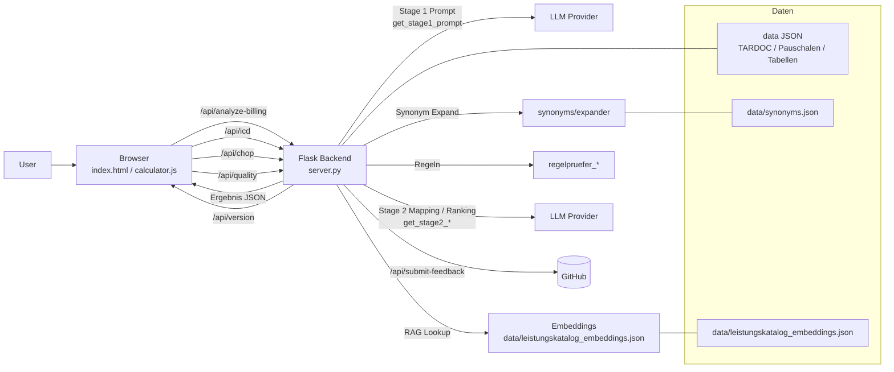
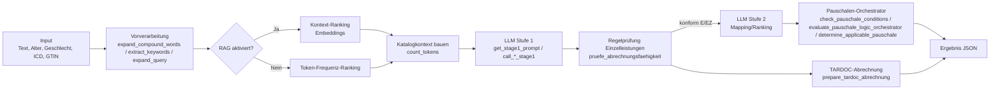

# Technische Dokumentation

## Architektur (Diagramm)



## Interne Querverweise

- Endpoints in `server.py`: `/api/analyze-billing`, `/api/icd`, `/api/chop`, `/api/quality`, `/api/test-example`, `/api/submit-feedback`, `/api/approved-feedback`, `/api/version`. Synonyms‑Stub: `/api/synonyms/*` (`synonyms/api.py`).
- Prompts: `prompts.get_stage1_prompt`, `prompts.get_stage2_mapping_prompt`, `prompts.get_stage2_ranking_prompt`.
- Wrapper: `openai_wrapper.chat_completion_safe`, `openai_wrapper.enforce_llm_min_interval`.
- Regeln: `regelpruefer_pauschale.evaluate_pauschale_logic_orchestrator`, `regelpruefer_einzelleistungen.pruefe_abrechnungsfaehigkeit`.
- Utils: `utils.get_table_content`, `utils.get_lang_field`, `utils.translate`, `utils.extract_keywords`, `utils.expand_compound_words`.
Hinweise ab Version 3.1–3.3
- LLM-Aufrufe über generischen Wrapper (`openai_wrapper.chat_completion_safe`) für Gemini, OpenAI, Apertus (OpenAI-kompatibel), Ollama-kompatibel.
- Stage‑2 mit separaten Temperaturen für Mapping/Ranking: `stage2_mapping_temperature`, `stage2_ranking_temperature` (in `config.ini`).
- Granulares Logging unter `[LOGGING]` (u. a. LLM‑Eingabe/Prompt/Output, Tokenzähler; Rotations‑Logging).
- Endpoint `/api/version` liefert App‑ und Tarifversion.
- Details zu UI‑Änderungen und Fixes siehe `CHANGELOG.md`.

Diese Datei gibt einen Überblick über die Architektur und den Code des Arzttarif‑Assistenten. Sie richtet sich an Entwickler, die sich schnell im Projekt zurechtfinden möchten.

## 1. Gesamtübersicht

Die Anwendung besteht aus einem Python‑Backend (Flask) und einem HTML/JavaScript‑Frontend. Nutzer geben im Browser eine medizinische Leistungsbeschreibung ein. Das Backend ruft anschliessend ein Large‑Language‑Model auf (konfigurierbar: z. B. Gemini, OpenAI, SwissAI/Apertus, Ollama‑kompatibel), prüft die resultierenden Leistungspositionen mit lokalen Regeln und entscheidet, ob eine Pauschale oder einzelne TARDOC‑Leistungen verrechnet werden sollen. Die Ergebnisse werden als JSON an das Frontend zurückgegeben und dort dargestellt.

Grober Ablauf:

1. **Frontend (`index.html`, `calculator.js`)** sammelt Eingaben (Freitext, ICD/GTIN, Alter, Geschlecht).
2. **Backend (`server.py`)**
   - ruft `call_gemini_stage1()` auf, um mögliche Leistungspositionen (LKN) und Kontext zu erkennen.
   - führt Regelprüfungen in `regelpruefer_einzelleistungen.py` und `regelpruefer_pauschale.py` aus.
   - wählt eine passende Pauschale oder erstellt eine TARDOC‑Abrechnung.
3. **Antwort** inkl. Details zur Regelprüfung wird an das Frontend gesendet und angezeigt.

## 2. Hauptprozesse (Pipeline)

### Stage‑1‑Promptaufbau (Kurzüberblick)
- Der Prompt enthält einen langen, mehrsprachigen Anweisungsteil aus `prompts.get_stage1_prompt` (Regeln, JSON‑Format, Qualitätschecks).
- Darin eingebettet ist der Katalogkontext (`katalog_context`) mit bis zu 5 relevanten LKN‑Zeilen inkl. Beschreibung, medizinischer Interpretation und `Demografie:`‑Hinweisen.
- Wenn `_build_context_for_llm` Synonymvarianten erzeugt, entsteht zusätzlich ein „Wichtige Synonyme“-Block mit allen Varianten (teils hunderte Einträge).
- Am Ende folgt der Originaltext des Nutzers zwischen `--- Start ... ---` Markern.
- `call_gemini_stage1` misst die Länge (`count_tokens`) und versucht bei Überschreitung des Budgets (Standard 8000 Tokens) den Prompt proportional zu kürzen.


### 2.1 Vorverarbeitung & Kontextaufbau
- Eingaben (`inputText`, optionale ICD/GTIN, Alter, Geschlecht) werden bereinigt.
- Synonymkatalog (falls aktiviert) erweitert Suchbegriffe via `synonyms/expander.expand_query`; ansonsten werden nur Rohbegriffe verwendet. Zusätzlich werden explizite LKN-Codes per Regex (`extract_lkn_codes_from_text`) sowie demografische Hinweise (Alter/Geschlecht) aus dem Freitext extrahiert.
- Hybrides Ranking: direkte LKN/ Synonym-/Demografie-Treffer kommen zuerst, darauf folgen gewichtete Schlüsselworttreffer (`rank_leistungskatalog_entries`) und – falls RAG aktiv ist – Embedding-Ergebnisse aus dem FAISS-Index (`rank_embeddings_entries`). Eine Fallback-Variantensuche sorgt für mindestens 5 Kandidaten.
- Durch `expand_compound_words` und `extract_keywords` werden Suchterm‑Varianten erzeugt (optional unter Nutzung des Synonymkatalogs).

### 2.2 LLM‑Stufe 1 – Identifikation von LKN
- Funktion: je nach Provider `call_gemini_stage1` oder `call_openai_stage1`
- Prompt: `prompts.get_stage1_prompt`
- Eingabe: aufbereiteter Katalogkontext + Nutzereingabe (inkl. optionaler Query‑Varianten)
- Ausgabe: JSON mit Feldern `identified_leistungen`, `extracted_info`, `begruendung_llm`
- Zweck: Erkennen aller relevanten Leistungspositionen (LKN) und Kontextinformationen

#### 2.2.1 Vorbereitung der Eingabe
- Aufsplitten zusammengesetzter Wörter (`expand_compound_words`).
- Schlüsselwort‑Extraktion und optionales Synonym‑Mapping (`extract_keywords`, `expand_query`).
- Sammeln explizit erwähnter LKN‑Codes, damit der Kontext nicht leer bleibt.
- Demografie-Heuristik: `extract_patient_demographics` leitet Alter/Geschlecht aus dem Freitext ab, gleicht sie mit TARDOC-Min/Max-Alter und Geschlechtereinschränkungen ab und nutzt die Hinweise sowohl als zusätzliche Suchtokens als auch als Seed für passende Zuschläge.
Diese Schritte erzeugen einen bereinigten Behandlungstext sowie eine Tokenmenge als Suchanker für den Katalog.

#### 2.2.2 Aufbau des Katalogkontextes
- Aus gerankten LKNs wird zeilenweise ein Kontextstring generiert: `LKN: <Code>, Typ: <Typ>, Beschreibung: <Beschreibung>, MedizinischeInterpretation: <…>, Demografie: <Alters-/Geschlechtsinfo falls vorhanden>`.
- Der String fliesst in den Prompt; seine Länge wird mit `count_tokens` heuristisch gezählt (regex‑basiert, modellabhängige Abweichung möglich).

#### 2.2.3 HTTP‑Payload & Modelleinstellungen
- Bei Gemini wird der vollständige Prompt als `text` gesendet.
- Wichtige Felder für Gemini‑Aufrufe in `server.py`:
  - `response_mime_type = application/json`
  - `maxOutputTokens = 65536`
  - `generationConfig.temperature` typ. niedrig (Standard 0.05; pro Modell/Stage über `config.ini` steuerbar)
- Ziel ist ein deterministisch wirkendes, rein JSON‑basiertes Ergebnis. Für OpenAI‑kompatible Provider erfolgt die analoge Ansteuerung via `openai_wrapper.chat_completion_safe`.

#### 2.2.4 Promptstruktur und Zweck
Der Prompt (DE/FR/IT Varianten) enthält:
1. Aufgabenbeschreibung und Katalogkontext
2. Schrittweise Anweisungen (Analyse, LKN‑Identifikation, Mengenregeln, Validierung, Kontext‑Extraktion, JSON‑Ausgabe)
3. Exaktes JSON‑Schema mit `identified_leistungen`, `extracted_info`, `begruendung_llm`
4. Wiederholung des Behandlungstextes
Diese Struktur zwingt das Modell, Tätigkeiten zu finden, Mengen zu berechnen und strikt JSON zu liefern.

#### 2.2.5 Rückgabestruktur (Validierung/Normalisierung)
- `identified_leistungen`: Liste von Objekten mit `lkn` (string), `typ` (string), `beschreibung` (string), `menge` (int). Fehlende/fehlerhafte Werte werden korrigiert, `lkn` wird upper‑cased.
- `ranking_candidates`: Vom Hybrid-Ranking (direkte Codes, Keywords, Embeddings) ermittelte LKN-Liste zur Anzeige im UI.
- `extracted_info` mit Defaults und Typkonvertierung:
  - `dauer_minuten`, `menge_allgemein`, `alter`, `anzahl_prozeduren`: `int | null`
  - `geschlecht`: `str | null`
  - `seitigkeit`: `str | null` mit Default `"unbekannt"`
- `begruendung_llm`: kurzer Erklärungstext (String).

#### 2.2.6 Tokenumfang & Limitationen
- Promptinstruktionen: ca. 700–1 000 Tokens (sprachabhängig).
- Katalogkontext: bis zu mehrere hundert LKN‑Zeilen; typischerweise 10 000–20 000 Tokens.
- Behandlungstext: meist < 200 Tokens.
Hinweise: `count_tokens` ist eine Regex‑Heuristik; tatsächliche Modell‑Tokens können abweichen. Grosse Kontexte erhöhen Zeit/Kosten; zusätzliche Validierung fängt nicht‑parsbare JSONs ab.

#### 2.2.7 Optimierungsansätze
- Kontextbeschränkung oder dynamisches Trimmen (Budget/Temp in `config.ini`).
- Exaktere Tokenberechnung (modell‑spezifische Tokenizer) bei Bedarf.
- Modularere Promptaufbereitung zur vereinfachten Wartung/Tests.
- Frühzeitige JSON‑Validierung (Schema/Function Calling), um Parserfehler zu reduzieren.

### 2.3 Regelprüfung Einzelleistungen
- Modul/Funktion: `regelpruefer_einzelleistungen.pruefe_abrechnungsfaehigkeit`
- Prüflogik:
  - Mengenbeschränkung (`REGEL_MENGE`)
  - Kumulations‑/Exklusivregeln
  - Patientenbedingungen (Alter, Geschlecht, GTIN)
  - Diagnosepflicht (ICD)
  - Pauschalenausschlüsse
- Nicht bestandene Regeln führen zu Fehlermeldungen; Mengen werden ggf. reduziert. Ausgabe: Liste regelkonformer LKN (`rule_checked_leistungen_list`).

### 2.4 Pauschalenprozess (LLM‑Stufe 2)

#### 2.4.1 LKN‑Mapping
- Nur für regelkonforme LKN des Typs `E`/`EZ` relevant.
- Funktionen: `call_gemini_stage2_mapping` bzw. `call_openai_stage2_mapping`.
- Kandidaten stammen aus `PAUSCHALEN_Leistungspositionen.json`, Bedingungen (`PAUSCHALEN_Bedingungen.json`) und Tabellen (`PAUSCHALEN_Tabellen.json`).
- Ziel: Mapping auf Pauschalen‑LKN, deren Bedingungen erfüllt sein könnten.

#### 2.4.2 Kandidatensuche & Ranking
- Potentielle Pauschalencodes werden aus LKN‑Zuordnungen und Regelbedingungen gesammelt.
- LLM‑Stufe 2 Ranking: `call_gemini_stage2_ranking` bzw. `call_openai_stage2_ranking` kann Kandidaten gewichten und sortieren.
- Ergebnis: Liste `ranked_codes` (beste Pauschalen zuerst, dedupliziert).

#### 2.4.3 Strukturierte Bedingungen & Hauptprüfung
- Hauptlogik in `regelpruefer_pauschale`:
  - `check_pauschale_conditions` erstellt HTML‑Detailergebnisse und Fehlermeldungen.
  - `evaluate_pauschale_logic_orchestrator` bewertet UND/ODER‑Logik (inkl. WHERE‑Klauseln) oder fällt heuristisch auf AST‑Auswertung zurück.
  - `determine_applicable_pauschale` wählt die bestbewertete, regelkonforme Pauschale (Score v. a. Taxpunkte; alternativ LLM‑Ranking).
- Performance: vorberechnete Indizes (`pauschale_lp_index`, `pauschale_cond_*`, `lkn_to_tables_index`) und ein separater Renderer (`pauschale_renderer.with_table_content_cache`) reduzieren Lookups und HTML-Generierung.
- `prepare_tardoc_abrechnung` sammelt abrechenbare Einzelleistungen für TARDOC.

### 2.5 Ergebnisaufbau
- Response enthält:
  - ggf. gefundene Pauschale samt Regel‑HTML (Details/Begründungen)
  - Liste regelkonformer Einzelleistungen
  - Zeitmessung, Tokenstatistik (wenn aktiviert), Log‑Hinweise
- Feedback‑Endpunkte zur QS sind vorhanden (`/api/submit-feedback`, `/api/approved-feedback`).

### 2.6 Betriebsmodi: Synonymkatalog & RAG
- Mit Synonymkatalog/RAG:
  - Suchterm‑Expansion: `expand_query` nutzt `data/synonyms.json` (mehr Treffer, Risiko von Ausreissern)
  - Ranking: Kombination aus gewichteter Schlüsselwortsuche und Embedding‑Ähnlichkeit (`data/leistungskatalog_embeddings.json`)
  - Datenbedarf: Synonyme + Embeddings
- Ohne Synonymkatalog/RAG:
  - Nur originaler Nutzertext, direkte LKN und demografische Hinweise
  - Ranking: Token‑Frequenz‑Vergleich inkl. Fallback-Variantsuche (kein Embedding)
  - Datenbedarf: nur Leistungskatalog
- Fehlerquellen: Falsche Synonyme oder geringe Abdeckung vs. geringere Treffergenauigkeit ohne Synonyme/RAG.

### 2.7 Pauschalen vs. Einzelleistungen (Ablauf)
- Einzelleistungen: Stufe 1 findet LKN; Regelprüfung reduziert/eliminiert unzulässige Leistungen. Für TARDOC wird eine Abrechnungsliste erstellt.
- Pauschalen:
  1. Ermittlung möglicher Pauschalencodes aus LKN & Bedingungen
  2. Optionales LLM‑Mapping zusätzlicher LKN
  3. Strukturierte Bedingungsprüfung
  4. Optionales LLM‑Ranking zur Priorisierung
  5. Ergebnis enthält detaillierte HTML‑Darstellung der erfüllten/fehlenden Bedingungen

## 3. Projektstruktur

- `server.py` – zentrale Flask‑Applikation und API‑Endpoints.
- `regelpruefer_einzelleistungen.py` – Prüfung der TARDOC‑Regeln pro Leistung.
- `regelpruefer_pauschale.py` – Logik zur Prüfung von Pauschalen.
- `utils.py` – Hilfsfunktionen (z. B. Übersetzungen, Textaufbereitung, Keyword‑Extraktion).
- `calculator.js` / `quality.js` – Frontend‑Logik und Aufruf der API.
- `data/` – JSON‑Dateien mit Tarif‑ und Testdaten.
- `tests/` – Pytest‑basierte Unittests und Beispielaufrufe.

## 4. Wichtige Python‑Funktionen

### server.py

- `create_app()` – Initialisiert die Flask‑Instanz und lädt die JSON‑Daten einmalig.
- `load_data()` – orchestriert den Datenimport, ruft intern `_reset_data_containers()`, `_load_catalogs()`, `_load_optional_datasets()`, `_load_rules()`, `_build_indices()` auf.
- `call_stage1()` (anbieterspezifisch) – Kommuniziert mit dem konfigurierten LLM‑Provider (u. a. Gemini, OpenAI, Apertus) und liefert LKN‑Vorschläge und Kontext.
- API‑Endpoints:
  - `/api/analyze-billing` – Hauptendpunkt zur Analyse eines Freitexts.
  - `/api/chop` – Suchfunktion für CHOP‑Codes.
  - `/api/icd` – ICD‑Lookup.
  - `/api/quality` – Vergleich von Beispielrechnungen mit Baseline‑Ergebnissen.
  - `/api/test-example` – führt einen Beispieltest gegen `baseline_results.json` aus.
  - `/api/submit-feedback` – Speichert Feedback lokal oder erstellt GitHub‑Issues.
  - Optional: `/api/synonyms/*` – Blueprint für künftige Synonym‑Operationen.

### regelpruefer_einzelleistungen.py

- `lade_regelwerk()` – lädt das Regelwerk für Einzelleistungen.
- `pruefe_abrechnungsfaehigkeit()` – überprüft Mengenbeschränkungen, Kumulationen und Patientenbedingungen.
- `prepare_tardoc_abrechnung()` – fasst regelkonforme Leistungen für die spätere Abrechnung zusammen.

### regelpruefer_pauschale.py

- `evaluate_pauschale_logic_orchestrator()` – prüft, ob alle Bedingungen einer Pauschale erfüllt sind.
- `determine_applicable_pauschale()` – wählt anhand von Regeln und Prioritäten die beste Pauschale aus.
- `generate_condition_detail_html()` – erzeugt HTML‑Berichte für die einzelnen Bedingungen.

### utils.py

Enthält verschiedenste Helfer:
- `expand_compound_words()` – zerlegt zusammengesetzte Wörter für bessere LLM‑Erkennung.
- `extract_keywords()` – liefert Schlüsselbegriffe aus einem Text, wobei Synonyme berücksichtigt werden.
- `compute_token_doc_freq()` und `rank_leistungskatalog_entries()` – unterstützen das Ranking von LKN anhand der Texte im Leistungskatalog.
- Zusätzlich einfache Übersetzungen (`translate`, `translate_rule_error_message`) und HTML‑Hilfen.

### Synonymverwaltung

Der Synonymkatalog liegt in `data/synonyms.json` und wird beim Start des
Servers geladen. Das Paket im Verzeichnis `synonyms/` bietet einen GUI‑Editor,
der über `python -m synonyms` gestartet wird, um neue Vorschläge zu erzeugen
oder Einträge zu kuratieren. Über den Abschnitt `[SYNONYMS]` in `config.ini`
lässt sich steuern, ob die Liste genutzt wird und wie sie heisst. Die Synonyme
fließen in die Stichwortsuche ein und erweitern Nutzeranfragen zur Laufzeit.

### RAG-Modus und Embeddings

Ab Version 2.6 kann der Kontext für das LLM stark verkleinert werden. Dazu werden
Vektordarstellungen des Leistungskatalogs mit `generate_embeddings.py` erzeugt
(`sentence-transformers` erforderlich) und als `leistungskatalog_embeddings.json`
gespeichert. Ist in `config.ini` unter `[RAG]` der Wert `enabled = 1` gesetzt,
werden beim Aufruf von `/api/analyze-billing` nur die passendsten Einträge an das
LLM geschickt.
Ohne RAG umfasst der Prompt mehr als 600 000 Tokens; mit RAG genügen rund 10 000.

Synonyme fließen aktuell nicht in die Embedding-Generierung ein.

Stattdessen nutzt `server.py` den Katalog zur Laufzeit, um Anfragen zu erweitern.

So greifen Änderungen an `data/synonyms.json` sofort ohne Neuaufbau des FAISS-Index.

Würden Synonyme in `generate_embeddings.py` eingebettet, müsste der Index bei jeder Anpassung neu erstellt werden.

Die dadurch entstehenden langen Texte würden den Vektorraum verwässern.

Besonders generische Begriffe könnten die Trennschärfe des Rankings mindern.

Außerdem ginge das explizite Logging der direkten Synonym-Treffer verloren.

Auch die getrennte Sprachbehandlung (de/fr/it) lässt sich zur Laufzeit besser steuern.

Deshalb bleibt die Synonym-Logik bewusst im Server und nicht im Embedding-Workflow.

### LLM‑Vergleich

Das Skript `llm_vergleich.py` testet verschiedene LLM-Provider und Modelle gegen
die in `data/baseline_results.json` hinterlegten Beispiele. In
`llm_vergleich_results.json` lässt sich pro Stufe ein eigener Provider und ein
eigenes Modell (`Stage1Provider`/`Stage1Model` bzw. `Stage2Provider`/`Stage2Model`)
angeben; fehlen diese Felder, gelten `Provider` und `Model` für beide Stufen. Für
jede Konfiguration werden Korrektheitsquote, Laufzeit und der benötigte
Tokenumfang ermittelt und im JSON gespeichert, sodass sich Kosten und Qualität
gegenüberstellen lassen.

## 5. Frontend

`calculator.js` und `index.html` bilden die Hauptoberfläche. Die Texte der Benutzeroberfläche werden aus `translations.json` geladen. Über `/api/analyze-billing` wird die Berechnung gestartet. `quality.js` bedient die Testseite `quality.html` und ruft `/api/quality` auf.

## 6. Tests und Qualitätssicherung

Die wichtigsten Tests liegen im Verzeichnis `tests/` und prüfen sowohl API‑Endpunkte als auch die Pauschalenlogik. Zusätzlich existiert `run_quality_tests.py`, das Beispieltexte gegen erwartete Baseline‑Ergebnisse vergleicht. Die Tests können mit

```bash
pytest
```

ausgeführt werden.

## 7. Daten und Konfiguration

Im Ordner `data/` liegen sämtliche JSON‑Dateien für Leistungskatalog, TARDOC‑Informationen und Pauschalen. Grosse Dateien werden über Git LFS versioniert. API‑Keys für den gewählten LLM‑Provider werden in einer `.env`‑Datei hinterlegt (z. B. `GEMINI_API_KEY`, `OPENAI_API_KEY`, `APERTUS_API_KEY`; optional `*_BASE_URL`). Weitere optionale Variablen (`GITHUB_TOKEN`, `GITHUB_REPO`) ermöglichen die automatische Erstellung von Feedback‑Issues.

### LLM‑Provider und Token‑Budget

Die Stufen‑Konfiguration erfolgt in `config.ini` unter `[LLM1UND2]` (`stage1_provider/_model`, `stage2_provider/_model`). Für OpenAI‑kompatible Provider (OpenAI, Apertus) stehen Budget‑ und Trimm‑Parameter unter `[OPENAI]` zur Verfügung; für Gemini entsprechende Optionen unter `[GEMINI]`. Über `[CONTEXT]` lässt sich der Kontextumfang granular steuern (`include_*`, `max_context_items`, `force_include_codes`).

### Aktualisierung der Datenbasis

Synonyme und Embeddings sind direkt an die Version des Leistungskatalogs gebunden. Die mitgelieferte `synonyms.json` wurde aus den Beschreibungen des `LKAAT_Leistungskatalog.json` erstellt. Sobald dieser Katalog oder andere Daten aktualisiert werden, muss der Synonymkatalog neu generiert werden, z. B. mit

```
python -m synonyms.cli generate --output data/synonyms.json
```

oder per GUI mit `python synonyms/synonyms.py`. Anschliessend müssen die Embeddings über

```
python generate_embeddings.py
```

neu erstellt werden, damit die Suche neue LKNs und Begriffe berücksichtigt.

### Dateiumbenennungen ab Version 1.1

Seit Version 1.1 tragen viele JSON-Dateien neue Namen. Die wichtigsten Änderungen:

| Alter Name                         | Neuer Name                          |
|------------------------------------|-------------------------------------|
| `tblLeistungskatalog.json`         | `LKAAT_Leistungskatalog.json`       |
| `tblPauschaleLeistungsposition.json` | `PAUSCHALEN_Leistungspositionen.json` |
| `tblPauschalen.json`               | `PAUSCHALEN_Pauschalen.json`        |
| `tblPauschaleBedingungen.json`     | `PAUSCHALEN_Bedingungen.json`       |
| `tblTabellen.json`                 | `PAUSCHALEN_Tabellen.json`          |
| `TARDOCGesamt_optimiert_Tarifpositionen.json` | `TARDOC_Tarifpositionen.json` und `TARDOC_Interpretationen.json` |

## 8. Dateien (Python/JS/HTML)

### Backend (Python)
- `server.py` – Flask‑Backend, Routen (`/api/*`, statisch), Orchestrierung Stage‑1/2, Regelprüfungen, Logging, Feedback‑API, `/api/version`.
- `regelpruefer_einzelleistungen.py` – Regeln für TARDOC‑Einzelleistungen (Mengen, Kumulationen, Patientenbedingungen) und Aufbereitung der Abrechnung.
- `regelpruefer_pauschale.py` – Pauschalen‑Bedingungen prüfen, Detail‑HTML generieren, Auswahl der passenden Pauschale.
- `utils.py` – Hilfsfunktionen: HTML‑Escapes, Sprachfelder, Tabellen‑Lookups, Übersetzungen, Tokenstatistiken, Ranking‑/Suchhelfer (RAG).
- `prompts.py` – Prompt‑Vorlagen für Stage‑1 (Extraktion) und Stage‑2 (Mapping/Ranking) in DE/FR/IT.
- `openai_wrapper.py` – Stabiler OpenAI‑kompatibler Chat‑Wrapper (Temperatur‑Handling, Throttling via `[LLM]`, User‑Agent, Fallbacks für Parameternamen).
- `generate_embeddings.py` – Erzeugt `data/leistungskatalog_embeddings.json` für den RAG‑Modus (benötigt `sentence-transformers`).
- `llm_vergleich.py` – Vergleicht Provider/Modelle anhand `llm_vergleich_results.json` und `data/baseline_results.json` (Korrektheit/Laufzeit/Tokenverbrauch).
- `run_quality_tests.py` – Führt QS‑Beispiele gegen Baseline durch und zeigt Tokenverbrauch an.
- `clean_json.py` – Entfernt Steuerzeichen aus JSON‑Dateien und schreibt `*.clean.json` (Import‑Helfer).
  
Hinweis: Das frühere Hilfsskript `update_prompts.py` (einmaliges Text‑Patchen für Prompts) wurde entfernt, da die Änderungen dauerhaft in `prompts.py` übernommen sind.

### Frontend (JS/HTML)
- `index.html` – Haupt‑UI (Formulareingabe, Sprache, ICD/CHOP/GTIN, Ergebnisdarstellung, Feedback‑Button).
- `calculator.js` – Frontend‑Steuerung der Analyse, UI‑Interaktionen, API‑Aufrufe (`/api/analyze-billing`, ICD/CHOP).
- `quality.html` – UI für Qualitätstests mit Beispielen.
- `quality.js` – Steuert `quality.html`, lädt Testfälle und ruft `/api/quality` auf.

### Synonyms‑Paket (Python/GUI)
- `synonyms/__main__.py` – Startpunkt `python -m synonyms`: Tkinter‑GUI für Generierung, Kuration, Vergleich, Embeddings‑Export.
- `synonyms/synonyms_tk.py` – GUI‑Dialoge/Widgets für Katalog‑Bearbeitung.
- `synonyms/diff_view.py` – Vergleich zweier Katalogstände, Hervorhebung (neu/gelöscht/geändert).
- `synonyms/generator.py` – Generiert Synonymvorschläge aus Tarifdaten per LLM (Provider/Temperatur via `config.ini`).
- `synonyms/expander.py` – Erweitert Suchanfragen um Synonyme (Backend‑Nutzung), Schalter zum Aktivieren/Deaktivieren.
- `synonyms/storage.py` – Laden/Speichern verschiedener Katalog‑Formate; Normalisierung, Indizes, Toleranz bei Encodings.
- `synonyms/models.py` – Strukturierte Modelle für Synonymkatalog und Einträge.
- `synonyms/scorer.py` – Scoring/Ranking von Synonymvorschlägen.
- `synonyms/api.py` – Minimaler Flask‑Blueprint (`/api/synonyms/*`) als Entwicklungs‑Stub.
- Stubs (Flask/requests) wohnen in `tests/mocks.py` und werden nur geladen, wenn Flask/requests fehlen.
- `synonyms/__init__.py` – Paketinitialisierung.

### Tests (pytest)
- `tests/test_server.py` – Tests für Analyse‑Endpoint, LKN‑Parsing, Internationalisierung des Kontexts, Feedback‑Fallback, `/api/version`.
- `tests/test_chop_endpoint.py` – Tests für `/api/chop`.
- `tests/test_icd_endpoint.py` – Tests für `/api/icd`.
- `tests/test_truncate_text.py` – Tests für Texthandling/Trunkierung (Kontextbeschränkung).
- `tests/test_pauschale_logic.py` – Logische Prüfung der Pauschalenbedingungen.
- `tests/test_pauschale_search.py` – Suche/Matching für Pauschalen (tokenbasiert/Keywords).
- `tests/test_pauschale_selection.py` – Auswahl der anwendbaren Pauschale aus Kandidaten.
- `tests/test_regelpruefer_einzelleistungen.py` – Einzelleistungs‑Regelwerk (Mengen/Kumulationen etc.).
- `tests/test_llm_connectivity.py` – Erreichbarkeit/Wrapper‑Verhalten für LLM‑Provider (Stubs/Mocks).
- `tests/test_llm_vergleich_providers.py` – Szenarien für `llm_vergleich.py` (Provider/Modelle).
- `tests/test_compare_catalogues.py` – Vergleich von Katalogständen (z. B. für Synonyme/Diff‑View).
- `tests/test_synonyms_expander.py` – Tests für Anfrage‑Erweiterung durch Synonyme.
- `tests/test_synonyms_generator.py` – Tests für Generierung/Temperaturen/Provider‑Auswahl.
- `tests/test_synonyms_storage.py` – Laden/Speichern/Normalisieren des Synonymkatalogs.
- `tests/test_synonyms_models.py` – Modellstruktur/Validierung.
- `tests/test_synonyms_evaluation.py` – Qualität/Scoring von Synonymvorschlägen.

---

Dieses Dokument bietet einen technischen Einstieg in die wichtigsten Komponenten des Projekts. Für Detailfragen empfiehlt sich ein Blick in die jeweiligen Quelltexte und die README‑Datei.
